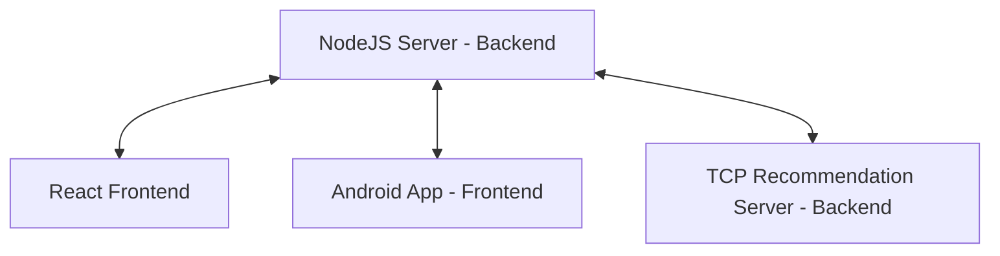

The full project wiki is [in the server repository submition](https://github.com/Mzhenian/CrispyCrumbsServer/tree/EX4-complete/wiki)

# Crispy Crumbs: React Website

Welcome to the **Crispy Crumbs** website, a video-sharing platform showcasing exclusive Crispy Crumbs content. Built with React, this website provides a smooth, interactive, and enjoyable user experience.

## Crispy Crumbs - Founders

- Ofek Avan Danan
- Zohar Mzhen
- Dolev Menajem

## Running the Crispy Crumbs Website

### Prerequisites

- The website is built and tested to run on a Windows machine.
- Node.js
- **TCP Recommendation Server**: The TCP server is necessary for video recommendations. Activate the [C++ TCP Server](https://github.com/Mzhenian/CrispyCrumbsTCP) following the instructions in the repository before starting the server. Without it, the website will display random videos in the suggested videos section.
- **Crispy Crumbs NodeJS Server**
  - [CrispyCrumbsServer](https://github.com/Mzhenian/CrispyCrumbsServer) must be set up before running the website. Follow the instructions in the repository to initialize the server correctly.
  - MongoDB: By default, the CrispyCrumbs server will use the "CrispyCrumbs" database at "mongodb://localhost:27017/CrispyCrumbs" and **will overwrite anything in it**.

### Download

- First, download [CrispyCrumbsWeb](https://github.com/Mzhenian/CrispyCrumbsWeb) and unzip it.
- **Or** [clone](https://github.com/Mzhenian/CrispyCrumbsWeb.git) the repository.
- Second, download [CrispyCrumbsServer](https://github.com/Mzhenian/CrispyCrumbsServer) and unzip it.
- **Don't forget to also set up the [C++ TCP Server](https://github.com/Mzhenian/CrispyCrumbsTCP)**, as it's essential for proper video recommendations.
- **Or** [clone](https://github.com/Mzhenian/CrispyCrumbsServer.git) the repository.

- **Recommended**: Use the initialization script by placing both projects in the same folder, named `CrispyCrumbsWeb` and `CrispyCrumbsServer` respectively, like this:
  

### Initialization Option One: Easy & Fast Script

After downloading the `CrispyCrumbsWeb` and `CrispyCrumbsServer` projects into the same parent folder:

1. Open a command prompt in the `CrispyCrumbsWeb` project folder.
2. Run: `.\init_website.cmd`
3. Wait for the website to open in the browser at [http://localhost:3000](http://localhost:3000).

**Notes:**

- To update the CrispyCrumbs server JWT secret, run `..\CrispyCrumbsServer\init_server.cmd` before running the website.
- If the server wasn't active when running the script, this method will open the **server** in a separate terminal.
- After this initial setup, you can run the website using the `npm start` command in both the `CrispyCrumbsWeb` and `CrispyCrumbsServer` project folders.

### Initialization Option Two: Manual Setup

1. Manually set up and run the server from [CrispyCrumbsServer](https://github.com/Mzhenian/CrispyCrumbsServer) as described in its README.md.
2. Open a terminal in the `CrispyCrumbsWeb` project folder.
3. Run `npm install`.
4. Run `npm start`.
5. Wait for the website to open in the browser at [http://localhost:3000](http://localhost:3000).

After the initial setup, you can run the website using the command `npm start` in the project folder, similar to the server.

### Logged-In User Experience

To quickly experience everything Crispy Crumbs has to offer, you can log in with a predefined user. For example:

- **Username:** Tuna
- **Password:** password6

## Website Pages Overview

### 1. Homepage

The homepage features a search bar at the top, along with buttons for sorting videos by "Most Watched", "Most Recent", and "Suggested for You". If you are logged in, you can access subscribed content, which shows videos from the users you follow. Video thumbnails with details such as views, upload date, and title are displayed.

- The top bar displays login and sign-up options if the user isn't registered. If the user is registered, the top bar will display an upload video button and a profile photo of the registered user. Clicking on the profile photo opens a popup menu with additional options. The top bar also includes the logo, a search bar, and a light/dark mode toggle.

### 2. Sign Up

This page is for user sign-up. It includes fields for entering full name, username, email, password, country, birthday, and phone number. There is also an option to upload a profile photo, and "Sign Up" and "Log In" buttons at the bottom.

### 3. Login

This page is for user login. It includes fields for entering the username and password, along with an option to remember the user. There are "Log In" and "Sign Up" buttons at the bottom.

### 4. Video Upload

This page allows users to upload videos. First, it opens a popup for the user to drag and drop a video. After selecting a video, the page includes fields for entering the video title, description, category, and tags. There is also an option to upload a thumbnail image for the video. At the bottom, there are "Upload" and "Cancel" buttons.

### 5. Video Page

This page shows a video player at the top left, playing the selected video. Below the video, there are details about the video, including the uploader's name, upload date, views, and tags. Logged-in users can see and add comments below the video. On the right side, there is a list of suggested or related videos with thumbnails and view counts. Users can edit or delete their own comments.

### 6. Edit Video

This page is similar to the Video Upload page but is used for updating an existing video. It includes the same fields: video title, description, category, and tags, along with the option to upload a thumbnail image. Users can also delete videos on this page.

### 7. Profile Page

This page displays user details and published videos.

### 8. Profile Edit Page

This page allows users to edit their details as well as their videos.

## Work Process

The project was a collaborative effort among the three founders. Initially, we focused on building the server. Afterward, we integrated server functions into the React application to interact directly with MongoDB. Most of the functionality and significant changes were implemented in the AuthContext and VideoContext since the core features were located there. There were also updates to specific pages and other areas requiring high functionality, but the website remains similar to its standalone version.

We used Jira to manage tasks and track progress throughout the project.

[Jira Missions](https://crispycrumbs.atlassian.net/jira/software/projects/SCRUM/list?sortBy=customfield_10020&direction=ASC)
